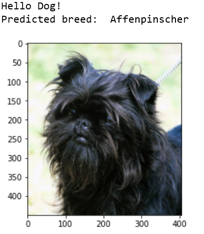
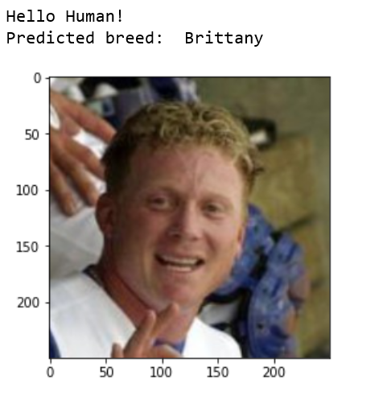

# Dog Breed Classifier 

### Project Overview:

The Dog breed classification problem is a well-known problem in Machine Learning. We can find it on Kaggle https://www.kaggle.com/c/dog-breed-identification/overview/description. The problem here is to identify the breed of dog if dog image is given as an input, and suppose if we gave an image of a humans as an input to the classifier, we have to identify the resembling dog breed to that human. The idea is to build a pipeline that can process real world user supplied images and identify an estimate of the canine’s breed. This is a multi-class classification problem where we can use supervised machine learning to solve this problem.

### Problem Statement:

The main aim of the project is to build a machine learning model that can be used within web app to process real-world, user-supplied images. The model has to perform two tasks:
* **Dog face detection**: Suppose if we gave any dog image as an input to the model, then that model will predict the canine’s breed.
* **Human face detection**: Suppose if we gave any dog image as an input to the model, then that model will predict the resembling dog breed.

### Data Exploration:

For this project, the input format must be of image type, because we want to input an image and identify the breed of the dog. All data for this project is provided by Udacity. We have pictures of dogs and pictures of humans.
* Dog images dataset: The dog image dataset has 8351 total images which are sorted into train (6,680 Images), test (836 Images) and valid (835 Images) directories. Each of this directory (train, test, valid) have 133 folders corresponding to dog breeds. The images are of different sizes and different backgrounds, some images are not full-sized. The data is not balanced because the number of images provided for each breed varies. Few have 4 images while some have 8 images.
Dog
* Human images dataset: The human dataset contains 13233 total human images which are sorted by names of human (5750 folders). All images are of size 250x250. Images have different background and different angles. The data is not balanced because we have 1 image for some people and many images for some.

### Algorithms and techniques:
For performing this multiclass classification, we can use Convolutional Neural Network to solve the problem. A Convolutional Neural Network (CNN) is a Deep Learning algorithm which can take in an input image, assign importance (learnable weights and biases) to various aspects/objects in the image and be able to differentiate one from the other. The solution involves three steps. First, to detect human images, we can use existing algorithm like OpenCV’s implementation of Haar feature based cascade classifiers. Second, to detect dog-images we will use a pre-trained VGG16 model. Finally, after the image is identified as dog/human, we can pass this image to CNN which will process the image and predict the breed that matches the best out of 133 breeds.

### Benchmark:
For our benchmark model, we will use the Convolutional Neural Networks (CNN) model created from scratch with an accuracy of more than 10%. This should be enough to confirm that our model is working because random guess would be 1 in 133 breeds which are less than 1% if we don’t consider unbalanced data for our dog images. The CNN model created using transfer learning must have accuracy of 60% and above.

### Data Preprocessing:
All the images are resized to 224*224, then the normalization is applied to all the images (train, valid and test datasets). For the training data, Image augmentation is done to reduce overfitting. The train data images are randomly rotated and random horizontal flip is applied. Finally, all the images are converted into tensor before passing into the model.

### Implementation:
I have built a CNN model from scratch using pytorch to solve the problem. The model has 3 convolutional layers. All convolutional layers have kernel size of 3 and stride 1. The first conv layer (conv1) takes the 224*224 input image and the final conv layer (conv3) produces an output size of 128*128. ReLU activation function is used here. The pooling layer of (2, 2) is used which will reduce the input size by 2. We have two fully connected layers that finally produces 133-dimensional output. A dropout of 0.25 is added to avoid over overfitting.

### Refinement:
The CNN model I have created from scratch got the accuracy of 24%. Although it meets the benchmarking, the model can be significantly improved by using transfer learning. To create CNN with transfer learning, I have selected the Resnet101 architecture which is pre-trained on ImageNet dataset, the Resnet101 architecture have 101 layers deep. The last convolutional output of Resnet101 is fed as input to our model. We only need to add a fully connected layer to produce 133-dimensional output (one for each dog category). The model performed extremely well when compared to CNN from scratch. With just 20 epochs, the model got 84% accuracy.

**Dog face detection**          |   **Human face detection**
:-------------------------:|:-------------------------:
  |  

### Justification:
I think the model performance is better than expected. The model created using transfer learning have an accuracy of 84% compared to the CNN model created from scratch which had only 24% accuracy.

### Executions instructions:

**1.Open the dog_app.ipynb file:**

**2.Read and follow the instructions! You can find and download the dataset for this project in the notebook.**

### Libraries:

The list below represents main libraries and its objects for the project.
* OpenCV 
* pytorch (CNN)
* numpy
* matplotlib

### References:
* CNN Wikipedia:
https://en.wikipedia.org/wiki/Convolutional_neural_network
* Original repo for Project - GitHub:
https://github.com/udacity/deep-learning-v2-pytorch/blob/master/project-dog-classification/
* Resnet101:
https://pytorch.org/docs/stable/_modules/torchvision/models/resnet.html#resnet101
